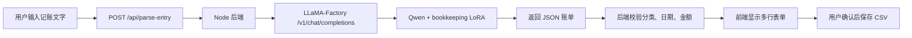

# 记账笔记

本项目是一个本地运行的个人记账 Web 应用，用于维护 CSV 账本、查看收支分析，并通过本地 Qwen + LoRA 模型把自然语言记账文本解析成结构化账单。

## 主要功能

- 新增、编辑、删除账单记录，并保存到 CSV。
- 文字智能解析：输入一句或多句记账文字，解析为多条账单表单。
- 支出分析：查看年度、月度、分类占比、分类明细和资金表数据。
- 月账单：按月份查看当月支出、收入、净额、每日支出日历和当月明细。
- 品类分析：按一级、二级、三级分类筛选，查看金额、均值、趋势和原始明细。
- 分类管理：新增、修改、删除 1/2/3 级分类。
- 自动备份：修改或删除原有分类并影响 CSV 时，会先备份原账本为 `dfsz_01.csv`、`dfsz_02.csv` 等。
- GitHub 推送脚本：一条命令检查、提交并推送代码。

## 技术结构

```text
public/index.html      页面结构
public/app.js          前端交互、表格、图表、筛选和保存逻辑
public/styles.css      页面样式
server.js              Node 后端、CSV 读写、模型调用、分类管理 API
start-qwen-api.ps1     启动本地 Qwen LLaMA-Factory API
start-bookkeeping.bat  双击启动 Qwen、记账服务并打开浏览器
打开记账笔记.vbs       隐藏 CMD 窗口的启动入口
push-github.ps1        检查、提交并推送 GitHub
```

## 数据文件

默认账本路径：

```text
F:\daysz\dfsz.csv
```

默认资金表路径：

```text
F:\daysz\hisdata\mark1.xlsx
```

CSV 字段：

```text
t,type,name1,name2,p,bak,month,year,ym
```

其中：

- `t`：日期，格式 `YYYY-MM-DD`
- `type`：一级分类，例如 `自己支出`、`家里支出`、`自己收入`
- `name1`：二级分类
- `name2`：三级分类
- `p`：金额
- `bak`：备注
- `month/year/ym`：后端保存时自动生成

`data/` 和 `datas/` 已被 `.gitignore` 忽略，真实账本数据不会上传 GitHub。

## 安装依赖

首次复制项目后，在项目目录执行：

```powershell
npm install
```

## 启动方式

### 推荐：双击启动

双击：

```text
打开记账笔记.vbs
```

它会隐藏启动入口窗口，并调用：

```text
start-bookkeeping.bat
```

启动脚本会：

1. 检查 Qwen API 是否已运行。
2. 未运行时启动 `start-qwen-api.ps1`。
3. 检查记账服务是否已运行。
4. 未运行时执行 `npm run start:qwen`。
5. 自动识别实际端口。
6. 用 Google Chrome 打开记账页面。

### 手动启动模型 API

```powershell
.\start-qwen-api.ps1
```

该脚本会启动 LLaMA-Factory OpenAI 风格接口：

```text
http://127.0.0.1:8001/v1/chat/completions
```

### 手动启动记账服务

```powershell
npm run start:qwen
```

默认从端口 `5174` 开始。如果端口被占用，会自动尝试 `5175`、`5176` 等。

## 文字智能解析流程



解析规则要点：

- 支持一句话解析多条记录。
- 支持中文金额，例如 `一千`、`两千`、`四百`。
- `今天`、`昨天`、`前天` 会按本机当前日期强制修正，避免模型返回训练样本中的旧日期。
- 未提到“家里”时，模型若返回 `家里支出`，后端会尽量修正为 `自己支出`。
- 分类必须在允许的 1/2/3 级分类组合中，否则会要求模型重试或报错。

## 分类管理

页面：`分类管理`

- “新增分类”只更新分类配置，不修改 CSV。
- “修改或删除原分类”会影响 CSV：
  - 先备份当前 CSV，例如 `dfsz_01.csv`
  - 再将更新后的分类写回 `dfsz.csv`
- 删除仍被账单使用的分类会被拒绝，避免账单数据丢失分类含义。

分类配置文件保存在账本同目录：

```text
dfsz.categories.json
```

## 月账单

页面：`月账单`

- 月份选择器支持左右箭头切换上个月、下个月。
- 当月每日支出日历默认显示 `自己支出` 的每日总额。
- 日历支持一级、二级、三级分类筛选。
- 当月明细默认显示 `支出`。
- 当月明细的一级、二级、三级分类和金额列支持升降排序。
- 明细表默认展示约 15 行，超出后在表格内部滚动。

## 常用命令

启动记账服务：

```powershell
npm run start:qwen
```

只检查 JS 语法：

```powershell
node --check server.js
node --check public\app.js
```

推送 GitHub：

```powershell
powershell.exe -NoProfile -ExecutionPolicy Bypass -File .\push-github.ps1
```

## GitHub 推送

项目内置：

```text
push-github.ps1
push-github.cmd
```

推送脚本会自动：

1. 执行 `git diff --check`
2. 检查 `server.js` 和 `public/app.js` 语法
3. 暂存代码变更
4. 阻止 `data/`、`datas/` 数据文件进入提交
5. 无变更时直接推送已有提交
6. 有变更时创建提交并推送 `main`
7. 通过本地代理 `http://127.0.0.1:7897` 访问 GitHub

如果在 Codex 中说：

```text
更新 Git
```

按项目约定会直接执行该脚本。

## 新电脑部署注意事项

基础功能需要：

- Windows
- Node.js
- 浏览器
- 项目代码
- 账本 CSV 和资金 Excel 文件

文字智能解析还需要：

- Conda 环境 `qwen_ft`
- LLaMA-Factory
- Qwen 基础模型
- bookkeeping LoRA
- 可用的模型配置文件：

```text
F:\LLaMA-Factory\examples\inference\qwen3_bookkeeping_lora_sft.yaml
```

如果路径不同，需要修改：

- `server.js` 中的默认 CSV 和资金表路径
- `start-qwen-api.ps1` 中的 LLaMA-Factory 配置路径

## 主要接口

```text
GET  /api/records       读取账单
POST /api/records       新增账单
PUT  /api/records       覆盖保存账单
POST /api/parse-entry   文字解析到账单
GET  /api/categories    读取分类
POST /api/categories    保存分类
GET  /api/funds         读取资金表
POST /api/csv-path      切换账本 CSV
POST /api/funds-path    切换资金表
```

