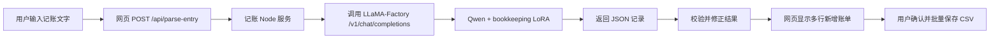

# 文字解析功能说明

## 整体调用流程



## 启动流程

需要启动模型 API 和记账服务两个服务。

### 1. 启动模型 API

运行 [`start-qwen-api.ps1`](../start-qwen-api.ps1)：

```powershell
$env:API_HOST = "127.0.0.1"
$env:API_PORT = "8001"
$env:API_MODEL_NAME = "gpt-3.5-turbo"

conda run -n qwen_ft llamafactory-cli api F:\LLaMA-Factory\examples\inference\qwen3_bookkeeping_lora_sft.yaml
```

该脚本会：

- 使用 `qwen_ft` Conda 环境。
- 加载 Qwen 基础模型和 bookkeeping LoRA。
- 在本机提供 OpenAI 风格接口：

```text
http://127.0.0.1:8001/v1/chat/completions
```

### 2. 启动记账服务

[`package.json`](../package.json) 中新增了：

```json
"start:qwen": "set OPENAI_BASE_URL=http://127.0.0.1:8001/v1&& set OPENAI_MODEL=gpt-3.5-turbo&& node server.js"
```

运行：

```powershell
npm run start:qwen
```

该命令会：

- 设置模型 API 地址为 `http://127.0.0.1:8001/v1`。
- 设置模型名称为 `gpt-3.5-turbo`。
- 启动记账 Node 服务和网页。

## 文字解析过程

### 1. 页面发送文字

用户点击“解析到表单”后，[`public/app.js`](../public/app.js#L1124) 获取输入文字并请求记账后端：

```javascript
const payload = await requestJson("/api/parse-entry", {
  method: "POST",
  body: JSON.stringify({ text }),
});
```

后端返回记录数组后，页面将记录显示为多行表单：

```javascript
fillEntryForms(payload.records);
```

### 2. 记账后端接收请求

[`server.js`](../server.js#L594) 提供接口：

```text
POST /api/parse-entry
```

收到文字后调用：

```javascript
parseEntryWithModel(text)
```

### 3. 调用本地 Qwen

核心调用位于 [`server.js`](../server.js#L399)。

记账后端向 LLaMA-Factory API 发送请求：

```javascript
fetch(`${LLM_BASE_URL}/chat/completions`, {
  method: "POST",
  body: JSON.stringify({
    model: LLM_MODEL,
    messages: [...]
  })
});
```

Qwen 返回的数据可能是单个对象、对象数组，或带 `records` 字段的对象：

```json
{
  "records": [
    {
      "t": "2026-06-01",
      "type": "自己支出",
      "name1": "食物支出",
      "name2": "甜品",
      "p": 32,
      "bak": "甜品"
    }
  ]
}
```

## 返回结果处理

模型结果不会直接写入账本，而是先由记账后端检查、归一化和补齐。

### 多笔记录处理

[`server.js`](../server.js#L307) 中的 `splitLedgerText()` 可以识别：

- 一句话中的多笔消费。
- 多个日期。
- 普通数字金额。
- 中文金额，例如“一千、两千、四百”。

应用优先使用模型对整段文字返回的多条结果。模型返回不完整或分类无效时，再将文字拆成单笔并分别调用模型补齐。

### 日期处理

支持将两位年份日期：

```text
26-06-01
```

转换为：

```text
2026-06-01
```

### 金额处理

当单笔输入中包含明确金额时，后端会用输入文字中的金额校正模型结果，支持：

```text
32
1000
一千
两千
四百
```

### 分类校验

模型返回的 `type / name1 / name2` 必须是表单类别列表中的有效组合，例如：

```text
自己支出 / 食物支出 / 甜品
家里支出 / 食物支出 / 零食
```

如果组合无效，后端会尝试让模型修正；整段结果仍然无效时，会逐笔重新解析。

### 分类稳定规则

[`server.js`](../server.js#L19) 中增加了类别别名和明确词语规则，例如：

```text
衣服 → 衣物
甜品/甜点/甜店 → 食物支出 / 甜品
手机 → 日用支出 / 电器电子
零食 → 食物支出 / 零食
```

这些规则用于处理训练数据冲突、模型同义词输出，以及模型偶尔返回的无效分类组合。

## 多行表单功能

原来的“新增账单”只能显示一条记录。

现在 [`public/index.html`](../public/index.html#L43) 使用动态多行表单容器：

```html
<form id="entryForm" class="entry-list"></form>
```

[`public/app.js`](../public/app.js#L172) 中的 `entryRowHtml()` 为每条记录生成一行，包括：

- 日期
- 一级分类
- 二级分类
- 三级分类
- 金额
- 备注
- 移除按钮

[`public/app.js`](../public/app.js#L195) 中的 `fillEntryForms()` 将模型返回的全部记录显示到页面。

用户可以：

- 修改每一条记录。
- 移除错误记录。
- 点击“全部保存到账表”批量保存。

批量保存由 [`public/app.js`](../public/app.js#L1146) 调用：

```text
POST /api/records
```

后端在 [`server.js`](../server.js#L584) 将全部记录一次性写入 CSV。

## 主要新增内容

| 文件 | 主要功能 |
|---|---|
| `start-qwen-api.ps1` | 启动本地 Qwen LLaMA-Factory API |
| `package.json` | 新增 `npm run start:qwen` |
| `server.js` | 调用模型、解析多条 JSON、校验分类、处理日期和中文金额 |
| `public/app.js` | 将模型结果显示为多行表单并批量保存 |
| `public/index.html` | 将单条新增表单改为动态多行容器 |
| `public/styles.css` | 多行账单紧凑单行布局 |

模型负责理解文字和判断分类；记账后端负责调用、校验、纠错和补齐；网页负责展示、人工确认和保存。
